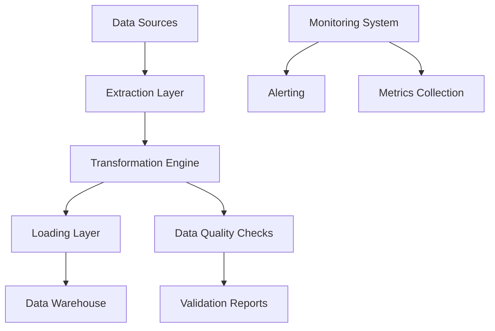

# Apache Airflow 대용량 데이터 파이프라인

엔터프라이즈급 Apache Airflow 기반 대용량 데이터 처리 파이프라인

## 🌟 주요 기능

### 📊 ETL 워크플로우 자동화
- **멀티 소스 데이터 수집**: API, 데이터베이스, 파일 시스템
- **병렬 처리**: 동시 다중 태스크 실행
- **의존성 관리**: 복잡한 워크플로우 관리
- **스케줄링**: 유연한 실행 스케줄

### ⚡ Pandas/Polars 성능 최적화
- **메모리 효율적 처리**: 청크 단위 데이터 처리
- **데이터 타입 최적화**: 자동 메모리 사용량 감소
- **병렬 변환**: 멀티프로세싱 활용
- **Polars 지원**: 고성능 DataFrame 처리

### 🔄 대용량 데이터 비동기 처리
- **비동기 I/O**: asyncio 기반 고성능 처리
- **배치 처리**: 대용량 데이터 분할 처리
- **메모리 모니터링**: 실시간 자원 사용량 추적
- **백프레셔 제어**: 시스템 부하 관리

### 🛡️ 에러 복구와 재시도 로직
- **다중 재시도 전략**: Fixed, Exponential, Linear, Jitter
- **Circuit Breaker**: 연쇄 장애 방지
- **예외 분류**: 재시도 가능/불가능 예외 구분
- **통계 수집**: 재시도 성공률 모니터링

### 📈 모니터링과 알림 시스템
- **Prometheus 메트릭**: 상세한 성능 지표 수집
- **실시간 알림**: 이메일, Slack, 웹훅 지원
- **데이터 품질 모니터링**: 자동화된 품질 검사
- **시스템 상태 감시**: 리소스 사용률, 서비스 상태

## 🚀 빠른 시작

### 사전 요구사항
- Docker & Docker Compose
- 최소 4GB RAM
- 2+ CPU 코어
- 10GB+ 디스크 공간

### 1. 설치 및 실행
```bash
# 프로젝트 클론 또는 다운로드
cd airflow

# 권한 설정 (Linux/Mac)
chmod +x scripts/*.sh

# 환경 설정
cp .env.example .env
# .env 파일에서 필요한 설정 수정

# 파이프라인 시작
./scripts/start.sh
```

### 2. 접속 정보
- **Airflow UI**: http://localhost:8080 (admin/admin)
- **Grafana**: http://localhost:3000 (admin/admin)
- **Prometheus**: http://localhost:9090
- **Flower**: http://localhost:5555

### 3. DAG 활성화
1. Airflow UI 접속
2. `large_data_etl_pipeline` DAG 활성화
3. `pipeline_monitoring_system` DAG 활성화

## 📁 프로젝트 구조

```
airflow/
├── dags/                          # Airflow DAG 파일
│   ├── large_data_etl_pipeline.py # 메인 ETL 파이프라인
│   └── monitoring_dag.py          # 모니터링 DAG
├── utils/                         # 유틸리티 모듈
│   ├── data_processor.py          # 데이터 처리 엔진
│   ├── retry_handler.py           # 재시도 로직
│   └── monitoring.py              # 모니터링 시스템
├── config/                        # 설정 파일
│   └── airflow.cfg               # Airflow 설정
├── data/                         # 데이터 저장소
│   ├── raw/                      # 원본 데이터
│   ├── processed/                # 처리된 데이터
│   └── logs/                     # 로그 파일
├── monitoring/                   # 모니터링 설정
│   ├── prometheus.yml           # Prometheus 설정
│   └── grafana/                 # Grafana 설정
├── scripts/                     # 실행 스크립트
│   ├── start.sh                 # 시작 스크립트
│   └── stop.sh                  # 중지 스크립트
├── Dockerfile                   # Docker 이미지
├── docker-compose.yml           # 서비스 구성
└── README.md                    # 문서
```

## 🔧 구성 요소

### ETL 파이프라인 아키텍처


### 핵심 구성 요소

#### 1. DataProcessor 클래스
```python
# 고성능 데이터 처리
processor = DataProcessor(
    chunk_size=10000,
    max_workers=4,
    memory_limit_gb=4
)

# Pandas 최적화 CSV 읽기
df = processor.pandas_optimized_read_csv('large_file.csv')

# Polars 고성능 처리
df = processor.polars_optimized_read_csv('large_file.csv')

# 병렬 변환
df = processor.parallel_transform(df, transform_func, 'column_name')
```

#### 2. RetryHandler 클래스
```python
# 재시도 전략 설정
retry_handler = RetryHandler(
    max_retries=5,
    base_delay=2.0,
    strategy=RetryStrategy.EXPONENTIAL
)

# 함수에 재시도 로직 적용
@retry(max_retries=3, strategy=RetryStrategy.JITTER)
def process_data():
    # 처리 로직
    pass
```

#### 3. 모니터링 시스템
```python
# 메트릭 수집
prometheus_metrics.record_data_processing(
    dag_id='etl_pipeline',
    task_id='transform',
    data_source='api',
    record_count=10000
)

# 알림 규칙 추가
alert_manager.add_alert_rule(AlertRule(
    name="high_failure_rate",
    condition=lambda m: m.get('failure_rate', 0) > 0.1,
    severity="critical"
))
```

## 📊 모니터링 대시보드

### 주요 메트릭
- **처리량**: 시간당 처리된 레코드 수
- **지연시간**: 태스크 실행 시간 분포
- **성공률**: DAG/태스크 성공률
- **데이터 품질**: 품질 점수 추이
- **리소스 사용률**: CPU, 메모리, 디스크

### 알림 조건
- 높은 실패율 (10% 이상)
- 긴 실행 시간 (1시간 이상)
- 낮은 데이터 품질 (80% 미만)
- 높은 메모리 사용률 (90% 이상)
- SLA 위반

## ⚡ 성능 최적화

### Pandas 최적화
- 데이터 타입 다운캐스팅
- 범주형 데이터 활용
- 청크 단위 처리
- 메모리 사용량 모니터링

### Polars 활용
- 지연 평가 (Lazy Evaluation)
- 자동 최적화
- 멀티스레드 처리
- 메모리 효율성

### 비동기 처리
- uvloop 사용
- 병렬 파일 읽기
- 비동기 데이터베이스 쓰기
- 배치 처리

## 🛠️ 설정 및 커스터마이징

### 환경 변수 설정
```bash
# .env 파일
CHUNK_SIZE=10000                    # 처리 청크 크기
MAX_WORKERS=4                       # 최대 워커 수
MEMORY_LIMIT_GB=4                   # 메모리 제한
AIRFLOW__CORE__PARALLELISM=32       # Airflow 병렬성
```

### DAG 설정 커스터마이징
```python
# DAG 실행 주기
schedule_interval=timedelta(hours=1)

# 재시도 설정
retries=3
retry_delay=timedelta(minutes=5)
retry_exponential_backoff=True

# 병렬성
max_active_tasks=10
max_active_runs=2
```

## 🔍 문제 해결

### 일반적인 문제

#### 메모리 부족
```bash
# 메모리 사용량 확인
docker stats

# 청크 크기 줄이기
CHUNK_SIZE=5000
```

#### 성능 저하
```bash
# 워커 수 조정
MAX_WORKERS=2

# 병렬성 설정 조정
AIRFLOW__CORE__PARALLELISM=16
```

#### 데이터베이스 연결 오류
```bash
# PostgreSQL 상태 확인
docker-compose logs postgres

# 연결 설정 확인
docker-compose exec airflow-webserver airflow db check
```

### 로그 확인
```bash
# Airflow 로그
docker-compose logs -f airflow-scheduler
docker-compose logs -f airflow-worker

# 특정 태스크 로그
# Airflow UI > DAG > Task > Logs
```

## 📈 확장성

### 수평 확장
- Celery Worker 노드 추가
- Kubernetes 배포
- 외부 메타데이터 DB 사용

### 수직 확장
- 메모리 및 CPU 증가
- SSD 스토리지 사용
- 네트워크 대역폭 증가

### 클라우드 배포
- AWS ECS/EKS
- Google Cloud Run
- Azure Container Instances

## 🚦 운영 가이드

### 정기 점검
- 디스크 사용량 모니터링
- 로그 로테이션 설정
- 메트릭 보존 정책
- 백업 및 복구 절차

### 보안
- 인증 설정 강화
- 네트워크 보안 그룹
- 비밀 정보 관리
- 액세스 로그 모니터링

## 🤝 기여 가이드

1. Fork 프로젝트
2. Feature 브랜치 생성
3. 변경사항 커밋
4. 테스트 실행
5. Pull Request 생성

## 📞 지원

- **문서**: 이 README 파일
- **로그**: Airflow UI의 로그 섹션
- **모니터링**: Grafana 대시보드
- **이슈**: GitHub Issues

---

**Built with ❤️ for Enterprise Data Processing**
